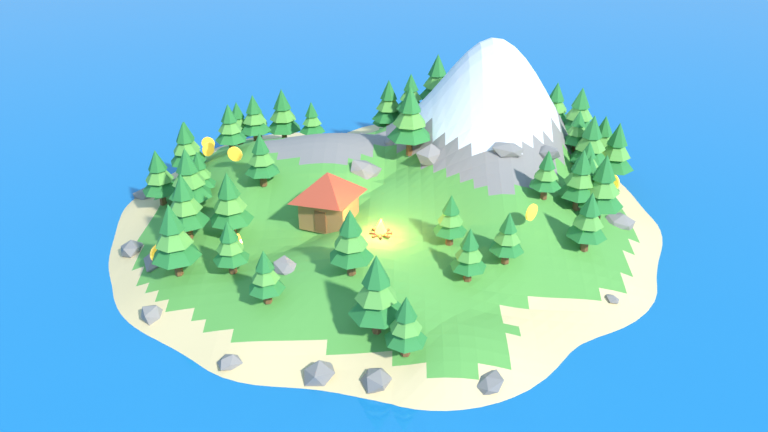

# הדגמת Blender: אי low-poly למשחק

סקריפט Python אחד שבונה בתוך Blender סצנה שלמה של משחק, בלי שום קובץ חיצוני.



**מה נבנה:** שטח עם גבעות והר מושלג, ים, 45 עצים, 25 סלעים, בקתה, מדורה זוהרת עם מקור אור, 8 מטבעות זהב שמסתובבים ומרחפים, תאורת שמש ומצלמה שמסתובבת סביב האי (240 פריימים).
כל האובייקטים מסודרים ב-Collections (`Environment` / `Props` / `Pickups`), כך שקל לייצא אותם למנוע משחק.

## איך מריצים

**מתוך Blender (גרסה 3.6 ומעלה, נבדק על 5.2):**
1. פותחים את לשונית **Scripting**
2. **Open** ← בוחרים את `low_poly_island.py`
3. **Run Script** (או Alt+P)
4. חוזרים ל-Layout, לוחצים על מקש `0` במקלדת הנומרית לתצוגת מצלמה, ואז רווח כדי לנגן את האנימציה

**משורת הפקודה:**
```bash
blender -b -P low_poly_island.py -- --seed 42 --save island.blend --export island.glb --render island.png
```
- `--seed` מחליף את מבנה האי: כל מספר יוצר אי אחר
- `--export` מייצא קובץ GLB שאפשר לגרור ישירות ל-Godot, Unity או Three.js

## המשחק: אי המטבעות (`web-game/`)

משחק תלת-ממד שרץ בדפדפן ובנוי על האי הזה בדיוק: מייצאים את הסצנה מ-Blender, וקוד המשחק טוען אותה. אוספים 8 מטבעות זהב מהר ככל האפשר. החץ בראש המסך מצביע על המטבע הקרוב, ויש שעון ושיא אישי.

- **מחשב:** `W A S D` או החיצים להליכה, רווח לקפיצה, `Q`/`E` או גרירה עם העכבר לסיבוב המצלמה
- **טלפון:** ג׳ויסטיק בפינה השמאלית, כפתור קפיצה צהוב, וגרירה על המסך לסיבוב המצלמה
- עצים, סלעים, הבקתה והמדורה חוסמים את הדרך. מים עמוקים ומדרונות תלולים מדי עוצרים את השחקן.

**הרצה מקומית:**
```bash
cd blender-demos/web-game
python3 -m http.server 8000     # ואז לפתוח http://localhost:8000
```

**אי אחר במשחק:** מייצרים GLB חדש עם seed אחר, וממירים אותו ל-`island.gltf.json` (glTF עם הנתונים בתוך הקובץ):
```bash
blender -b -P low_poly_island.py -- --seed 42 --export web-game/island.glb
python3 web-game/glb_to_gltf_json.py web-game/island.glb web-game/island.gltf.json
```
אפשר לייבא את `island.gltf.json` חזרה ל-Blender: משנים את הסיומת ל-`.gltf` ובוחרים File ← Import ← glTF.

---

## מקורות מומלצים להורדה

### 1. לחבר את Claude ישירות ל-Blender (הכי מומלץ)
| מקור | מה זה | למה |
|---|---|---|
| [MCP for Blender](https://github.com/ahujasid/blender-mcp) (לשעבר blender-mcp) | תוסף + שרת MCP בקוד פתוח, MIT | Claude שולט ב-Blender בזמן אמת: בונה, מזיז, מצלם את ה-viewport ומייבא נכסים מ-Poly Haven, Sketchfab ו-Poly Pizza. זה הפרויקט הקהילתי הפופולרי ביותר מסוגו (כ-30 אלף כוכבים). |
| שרת ה-MCP הרשמי של Blender Lab | שרת מטעם מפתחי Blender | לפי מקורות צד שלישי, גרסה 1.0 יצאה באפריל 2026. לא הצלחתי לאמת את זה מול blender.org, אז כדאי לבדוק באתר הרשמי. |

התקנה של MCP for Blender עם Claude Code:
```bash
uvx mcp-for-blender install-addon        # מתקין את התוסף
claude mcp add blender uvx mcp-for-blender
```
ב-Blender: Edit ← Preferences ← Add-ons ← להפעיל את "MCP for Blender". אחר כך N ב-viewport ← לשונית MCP for Blender ← **Start MCP Server**.

### 2. נכסים חינמיים (CC0, מותר לשימוש מסחרי)
| מקור | סגנון | פורמטים |
|---|---|---|
| [Poly Haven](https://polyhaven.com) | ריאליסטי: מודלים, טקסטורות PBR ו-HDRI | **.blend** מקורי, GLTF, FBX |
| [Kenney](https://kenney.nl/assets) | low-poly אחיד, מעל 270 חבילות | GLB, OBJ, FBX |
| [Quaternius](https://quaternius.com) | low-poly מסוגנן, כולל דמויות עם אנימציות | GLTF, FBX |
| [KayKit](https://kaylousberg.itch.io) | low-poly לדמויות ומבוכים | GLTF, FBX |
| [AmbientCG](https://ambientcg.com) | טקסטורות PBR | PNG/JPG |

### 3. פרויקטים ומנועים
| מקור | מה זה |
|---|---|
| [Godot](https://godotengine.org) + [Godot MCP של Coding-Solo](https://github.com/Coding-Solo/godot-mcp) | מנוע חינמי ש-Claude יכול להריץ ולערוך דרך MCP. מייבא GLB מ-Blender בלי שום המרה. |
| [Maaack's Godot Game Template](https://github.com/Maaack/Godot-Game-Template) | שלד מוכן של משחק: תפריטים, הגדרות, השהיה וטעינת שלבים (MIT) |
| [Armory3D](https://armory3d.org) | מנוע משחק שעובד בתוך Blender עצמו |
| [Sintel The Game](https://github.com/jonburesh/sintelgame) | משחק קוד פתוח שנבנה ב-Blender. דורש Blender 2.68 הישן, אבל שווה לראות בו איך בונים פרויקט. |
| [קבצי הדמו הרשמיים של Blender](https://download.blender.org/demo/) | קבצי .blend שמדגימים יכולות של התוכנה (רישיון CC-BY) |
